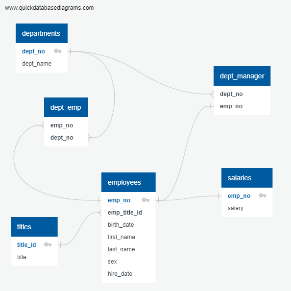

# SQL challenge
## Introduction
Design tables to hold the data from CSV files, import the CSV files into a SQL database, and then answer questions about the data.  
This Challenge is divided into three parts: data modeling, data engineering, and data analysis.  
## Part 1: Data Modeling
Inspected the CSV files, sketched an Entity Relationship Diagram of the tables. Used QuickDBD.  
  
  
---
  
## Part 2: Data Engineering
Created tables in the following order:
* departments
    * Primary key: _dept_no_
* titles
    * Primary key: _title_id_
* employees
    * Primary key: _emp_no_
    * Foreign key: _emp_title_id_ from _titles.title_id_
* salaries
    * Primary key: _emp_no_
    * Foreign key: _emp_no_ from _employees.emp_no_
* dept_emp
    * Primary key: _emp_no,dept_no_
    * Foreign keys: _emp_no_ from _employees.emp_no_, _dept_no_ from _departments.dept_no_
* dept_manager
    * Primary key: _emp_no,dept_no_
    * Foreign keys: _emp_no_ from _employees.emp_no_, _dept_no_ from _departments.dept_no_
  
---
  
## Part 3: Data Analysis
1. List the employee number, last name, first name, sex, and salary of each employee.  

2. List the first name, last name, and hire date for the employees who were hired in 1986.  

3. List the manager of each department along with their department number, department name, employee number, last name, and first name.  

4. List the department number for each employee along with that employee's employee number, last name, first name, and department name.  

5. List first name, last name, and sex of each employee whose first name is Hercules and whose last name begins with the letter B.  

6. List each employee in the Sales department, including their employee number, last name, and first name.  

7. List each employee in the Sales and Development departments, including their employee number, last name, first name, and department name.  

8. List the frequency counts, in descending order, of all the employee last names (that is, how many employees share each last name).  
